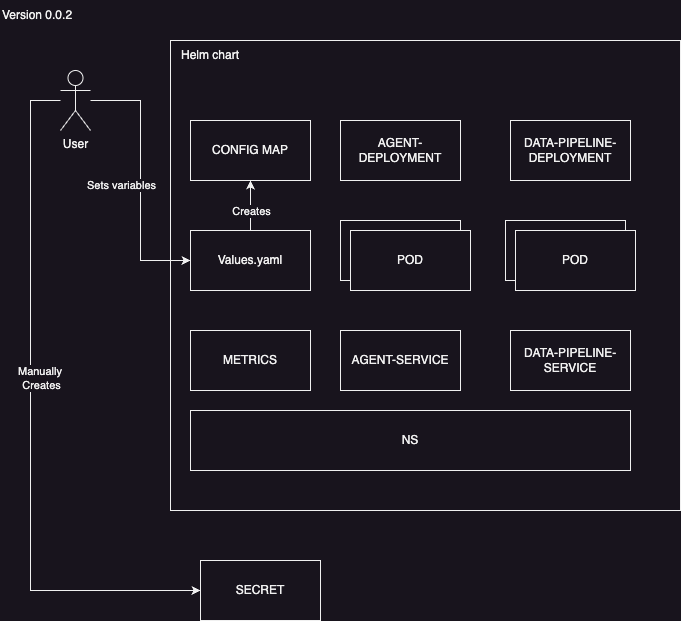

# KubeRAG


### A simple helm chart automating deployment of a retrieval augmented generation (RAG) solution on K8s Clusters.


# Architecture 


# Getting started 

Project consist of 2 folder Orchestrator and KubeRag

Orchestator is the main folder for two Application or Agent 

1 - Data Pipeline is responsible for ingestion and embedding the data 

in order to build the image start by running the docker build command 
```shell
docker buildx build . --platform=linux/amd64,linux/arm64 -t <your tag>
```


2 - Second portion is your agent:
you can use one of the sample applications or you can build your own 

you can build the docker image by running the following command 

```shell
docker buildx build . --platform=linux/amd64,linux/arm64 -t <your tag>
```


You can then install your Helm chart 
ensure you have a Kubernetes cluster set up and ready.

run following command to install the helm chart 

```shell
helm install my-release KubeRag-0.0.4 -f myvalues.yaml
```
